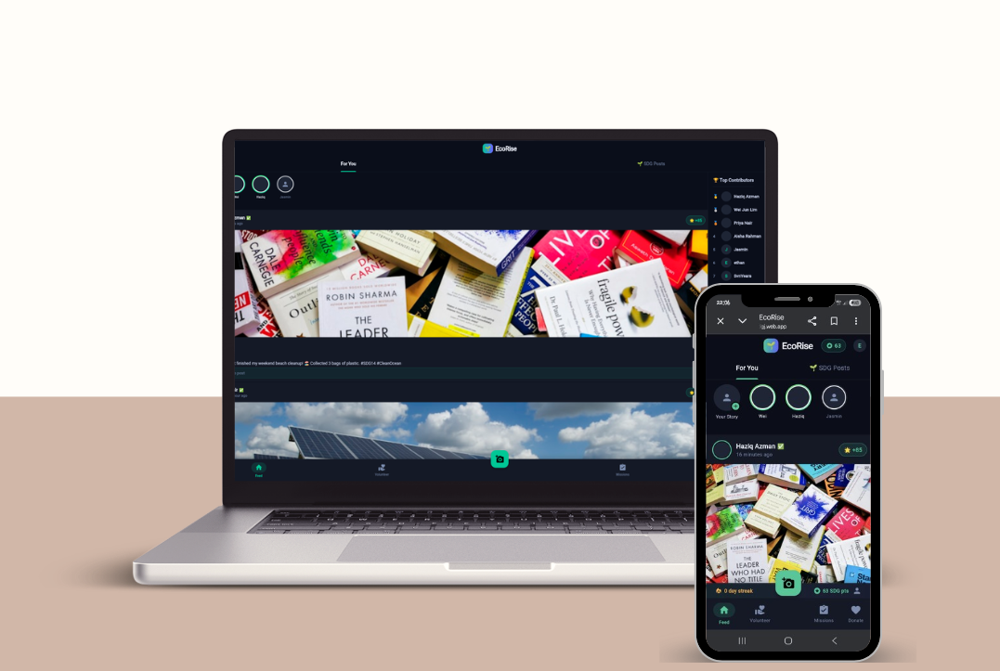

<div align="center">

# 🌿 EcoRise
### *A Sustainable Future Built Together*

[](https://flutter.dev)
[](https://dart.dev)
[](https://firebase.google.com)
[](https://ai.google.dev)

[](https://kitahack2026-f1f3e.web.app)
[](LICENSE)
[](https://kitahack2026-f1f3e.web.app)

[**Live Demo**](https://kitahack2026-f1f3e.web.app) • [**GitHub Repository**](https://github.com/EternalEthan06/KitaHack2026-Thon-Thon-Killers)

---



</div>

## 📑 Table of Contents
- [📖 About EcoRise](#-about-ecorise)
- [🚨 Problem Statement](#-problem-statement)
- [🎯 SDG Alignment](#-sdg-alignment)
- [✨ Key Features](#-key-features)
- [🏗️ System Architecture](#-system-architecture)
- [🛠️ Tech Stack](#-tech-stack)
- [📂 Project Structure](#-project-structure)
- [🚀 Getting Started](#-getting-started)
- [📱 Running the App](#-running-the-app)
- [⚠️ Challenges & Solutions](#-challenges--solutions)
- [🗺️ Future Roadmap](#-future-roadmap)
- [🏆 The Team](#-the-team)
- [📜 License](#-license)

---

## 📖 About EcoRise

**EcoRise** is a modern application built to promote sustainable development goals (SDGs) by integrating AI-driven impact analysis, social feeds, and rewarding donation systems. 

Developed for the **KitaHack 2026** hackathon by the **Thon Thon Killers**, EcoRise leverages generative AI to automatically verify and score user activities, ensuring seamless operations even under API restrictions with its revolutionary self-healing AI architecture.

---

## 🚨 Problem Statement

> We identified three core barriers preventing global sustainability:

### 🔍 A) Volunteer Connection Gap
People want to volunteer but lack a centralized, trusted platform, while NGOs struggle to recruit and promote events efficiently.

### 📉 B) Daily Motivation Deficit
SDGs feel abstract and unrewarding. No system tracks or gamifies real-life impact to build lasting habits.

### 💰 C) NGO Funding & Visibility Struggle
NGOs lack high-visibility channels for donations and product sales, struggling to compete with commercial algorithms on traditional social media.

---

## 🎯 SDG Alignment
EcoRise is designed to accelerate the **UN Sustainable Development Goals (SDGs)**, specifically focusing on:

| Goal | Description | Impact Area |
| :--- | :--- | :--- |
| **SDG 12** | Responsible Consumption & Production | Marketplace & Recycling |
| **SDG 13** | Climate Action | Carbon Tracking |
| **SDG 14/15** | Life Below Water & On Land | Volunteer Verification |

---

## ✨ Key Features

### 📸 Smart Impact Capture & AI Validation
* **Live Camera SDG Posts:** Capture sustainable actions in real-time. Our Gemini AI automatically analyzes the image and awards proportionate SDG Scores.
* **Gallery Uploads:** Share moments from your device gallery with the community.
* **Self-Healing AI Architecture:** Multi-stage fallback cycling through `gemini-1.5-flash`, `gemini-pro`, and `gemini-1.5-flash-8b`.

### 🌟 Gamified Sustainability & Rewards
* **Eco-Streaks:** Earn extra SDG points for maintaining daily action streaks.
* **Rewards Redemption:** Exchange SDG scores for real-world incentives like vouchers or planting actual trees.
* **Rewarding Donations:** Support charities directly and earn bonus points for your contribution.

### 🤝 Community & NGO Ecosystem
* **Social Platform:** A fully-featured space to share inspiration and communicate.
* **Volunteer Hub:** Dedicated space for NGOs to advertise programs.
* **NGO Marketplace:** Support non-profits by purchasing handmade and upcycled goods.

### 🛡️ Personalized Eco-Diary
* **Impact Tracking:** Every act is recorded in a personal ecological diary.
* **AI Recommendations:** Tailored suggestions based on your activity preferences.
* **Dynamic Profile:** Showcases your eco-journey and historical impact scores.

---

## 🏗️ System Architecture

EcoRise uses a **Decoupled AI Pipeline**. The UI generates a dedicated thread for the camera, while the AI Service processes multimodal analysis in the background.

### **Self-Healing Workflow**
1.  **Stage 1 (Primary)**: `gemini-1.5-flash` for high-speed analysis.
2.  **Stage 2 (Fallback)**: `gemini-pro` (Text) or `1.5-flash-8b`.
3.  **Stage 3 (Safety)**: **Demo Mode** with mock success data if total API failure occurs.

---

## 🛠️ Tech Stack

<details open>
<summary><b>Frontend & Mobile</b></summary>
<br>

| Technology | Purpose |
| :--- | :--- |
| **Flutter** | Cross-platform UI Development (PWA & Mobile) |
| **Dart** | Core application logic |
</details>

<details open>
<summary><b>Backend & AI</b></summary>
<br>

| Technology | Purpose |
| :--- | :--- |
| **Firebase RTDB** | Sub-millisecond social synchronization |
| **Cloud Firestore** | Structured user and NGO profile data |
| **Gemini AI** | Multimodal image verification & scoring |
| **Firebase Auth** | Secure user authentication |
</details>

---

## 📂 Project Structure

```text
lib/
├── core/
│   ├── services/     # Self-Healing AI, Firebase Logic, Auth
│   ├── models/       # SDG, Post, NGO, and User Models
│   └── theme/        # EcoRise Neon Design System
│
└── features/
    ├── feed/         # Social For-You & Certified SDG Feeds
    ├── camera/       # AI-driven Impact Analysis
    ├── volunteer/    # NGO Event & Calendar Integration
    └── donate/       # Rewarding Donation System (20x Points)
```

---

## 🚀 Getting Started

### 1. Prerequisites
* **Flutter SDK**: ≥ 3.3.0
* **Firebase Project**: Configured for Web/Mobile
* **Google AI Studio Key**: For Gemini AI access

### 2. Installation
```bash
# Clone the repository
git clone https://github.com/EternalEthan06/KitaHack2026-Thon-Thon-Killers.git

# Navigate to project
cd KitaHack2026-Thon-Thon-Killers

# Install dependencies
flutter pub get
```

### 3. Environment Setup
Create a `.env` file in the root:
```env
GEMINI_API_KEY=your_gemini_api_key_here
```

---

## 📱 Running the App

### **Web Deployment**
```bash
flutter run -d chrome
```

### **Mobile Testing**
For **Live Camera Verification**, use the optimized mobile runner:
```bash
.\run_mobile.bat
```

---

## ⚠️ Challenges & Solutions

*   **Architectural Migration**: We successfully migrated from Firestore to RTDB to handle high-frequency social data streams.
*   **AI Model Resilience**: Developed a multi-stage fallback system to handle varying API state and latency.
*   **Web-to-Mobile Parity**: Overcame browser constraints for image bytes using `Uint8List` processing.

---

## 🗺️ Future Roadmap

- [ ] **Google Maps Integration**: Visualizing local "Impact Clusters".
- [ ] **NGO Verified Partnerships**: 2x points for manually verified actions.
- [ ] **Eco-Marketplace Expansion**: Global voucher redemptions.
- [ ] **Offline Mode**: Local caching of impacts for remote volunteering.

---

## 🏆 The Team

| Member | Role |
| :--- | :--- |
| **Ethan Tiang** | Software Engineering |
| **Chloe Lai** | Software Engineering |
| **Lee Jasmin**| Robotics & Mechatronics |
| **Wong Kai Heng** | Robotics & Mechatronics |

---

## 📜 License
Distributed under the **MIT License**. See `LICENSE` for more information.

<div align="center">
Built with ❤️ by Thon Thon Killers for KitaHack 2026
</div>
